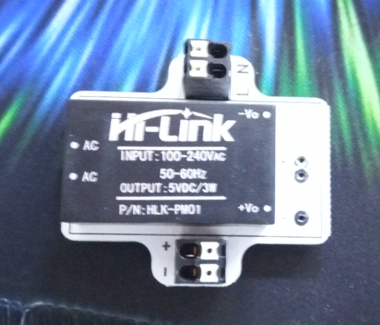
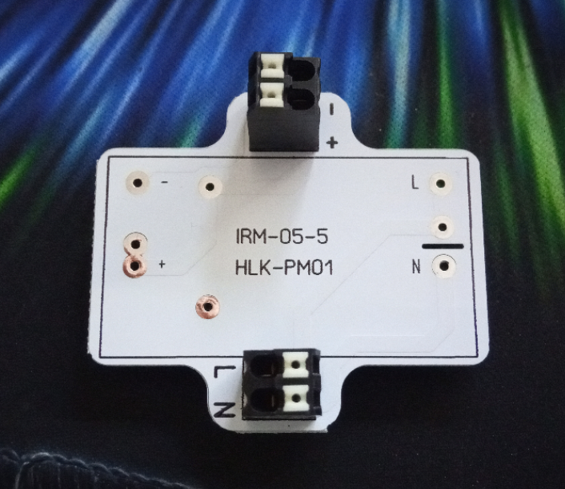
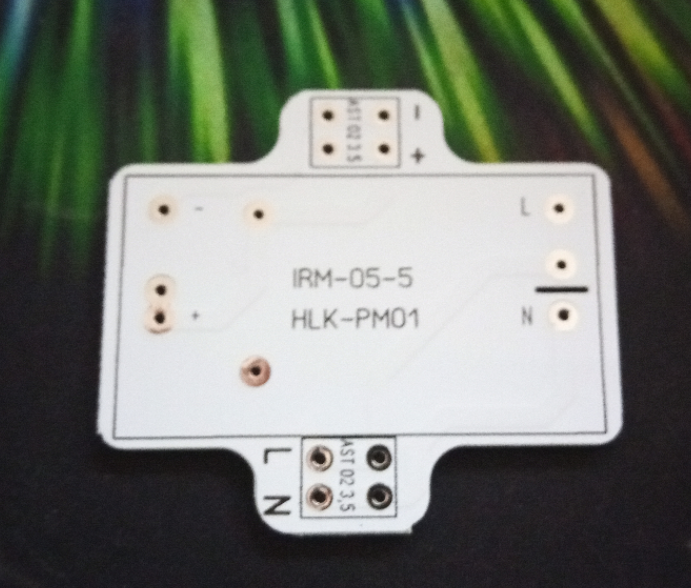
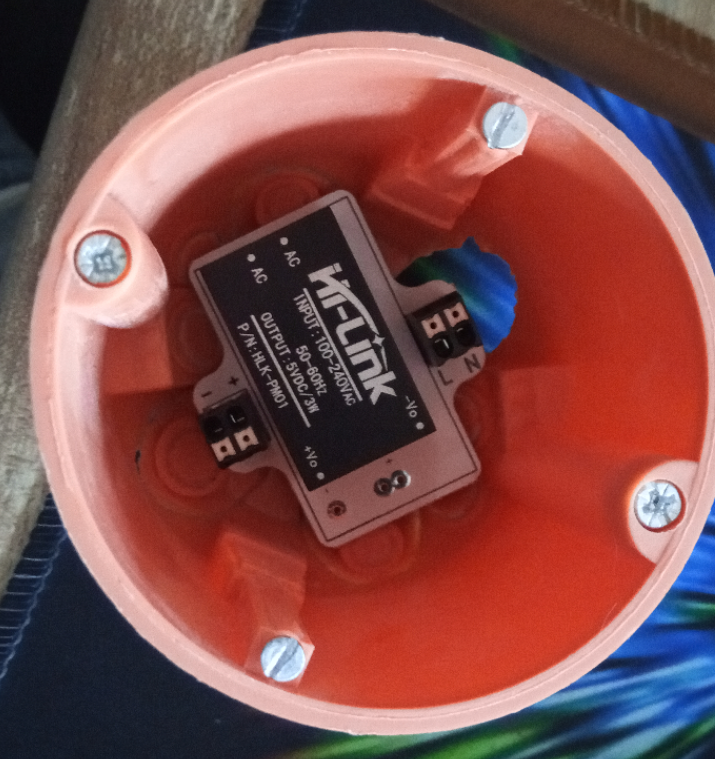

# Unterputz Netzteil Platine
## benötigte Hardware 

* 1x Netzteil MEAN WELL IRM-05-5 oder HI-Link HLK-PM01
* 2x Federkraftklemme 2-pol, Ø 1,5 mm, RM 3,5  (AST 02 3,5) 

[Kontakt via Facebook](https://www.facebook.com/ronny.thomas.83)

[Kontakt via Homematic Forum](https://homematic-forum.de/forum/memberlist.php?mode=viewprofile&u=13127)

